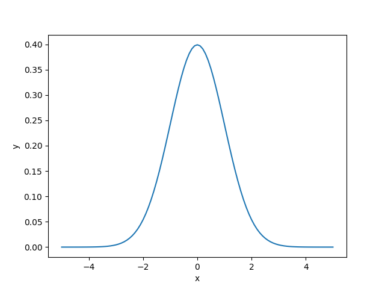
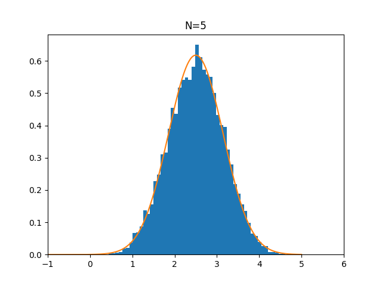

# Bell Curve

This repository is about normal distribution.

### Standard Normal Distribution

### Normal Distribution with Variable $\mu$

### Normal Distribution with Variable $\sigma$

### Central Limit Theorem

### Distribution of Sample Sum

### Multivariate Normal Distribution

